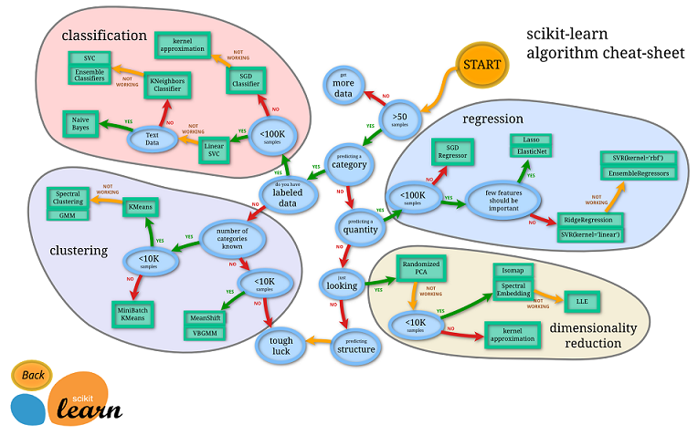

title: scikit-learn（一） 如何选择机器学习方法
summary: 如何选择机器学习方法
tags: Machine-Learning

Sklearn 官方提供了一个流程图， 蓝色圆圈是判断条件， 绿色方框是可以选择的算法。

由图中可以看出算法由四类，<strong>分类、回归、聚类、降维</strong>

其中<strong>分类和回归</strong>是监督式学些，即每个数据对应一个label。
<strong>聚类</strong>是非监督式学习，即没有label。
另外另一类是<strong>降维</strong>，当数据集由很多属性的时候，可以通过降维算法把属性归纳起来。
例如20个属性只变成2个，注意，这里不是挑出2个，而是压缩成2个，它们集合了20个属性的所有特征，相当于把重要的信息提取出的更好，不重要的信息就舍弃了。

首先要看问题属于哪一类问题，是分类还是回归，还是聚类，选择好相对应的算法。其中也还要考虑数据的大小。

