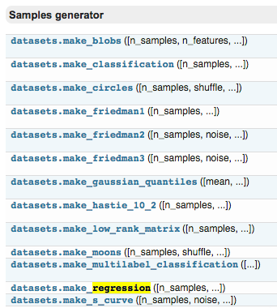
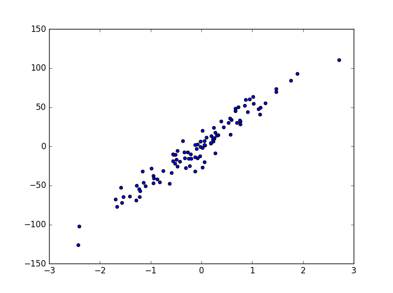

title: scikit-learn（三） sklearn的数据库
summary: 介绍sklearn的数据集
tags: Machine-Learning

# sklearn的数据集

`Sklearn`中有许多且游泳的`data set`，可以用来学习算法模型  
eg: boston放假，糖尿病，数字，Iris花。
也可以生成虚拟的数据，例如可以生成用来训练线性回归模型的数据等。



例如，点击进入boston房价的数据，可以看到`sample`的总数，属性，以及`label`等信息。


## 1.导入模块
导入`datasets`包，本文以`Linear Regression`为例。
```python
from sklearn import datasets
from sklearn.linear_model import LinearRegression
import matplotlib.pyplot as plt
```
***
## 2.导入数据 - 训练模型
用`dataset.load_boston()`的形式加载数据，并给`X`和`y`赋值，这种形式在`Sklearn`中都是高度统一的。
```python
model = LinearRegression()
loaded_data = datasets.load_boston()
data_X = loaded_data.data
data_y = loaded_data.target
```
***
可以直接用默认值来简历`model`，也可以自己改变参数使模型更好。然后用`training data`去训练模型。
```python
model = LinearRegression()
model.fit(data_X,data_y)
```
***
再打印出预测值，这里用X的前4个来预测，同时打印出真实值，可以看出是存在误差的。
```python
print model.predict(data_X[:4,:])
print data_y[:4]
```
***
> [ 30.00821269  25.0298606   30.5702317   28.60814055]  
[ 24.   21.6  34.7  33.4]
***
为了提高准确度可以通过尝试不同的model，不同的参数，不同的预处理方法，入门的话可以直接使用默认值。

## 3.创建虚拟数据 - 可视化
用函数来建立100个`samlpe`，有一个`feature`，一个`target`，这样比较方便可视化。  
```python
X, y = datasets.make_regression(n_samples=100,n_features=1, n_targets=1,noise=10)
```
***
用`scatter`的形式来输出结果。  
```python
plt.scatter(X,y)
plt.show()
```
***
  

可以看到用函数生成的`Linear Regression`用的数据。`noise`越大的话点就会越离散。
```python
X, y = datasets.make_regression(n_samples=100,n_features=1, n_targets=1,noise=50)
plt.scatter(X,y)
plt.show()
```
***
  

#### [本文全部代码](https://github.com/lxy-kyb/scikit-learn-tutorial/blob/master/datasets_try.py)