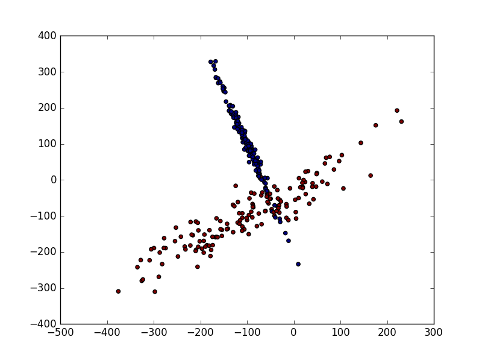
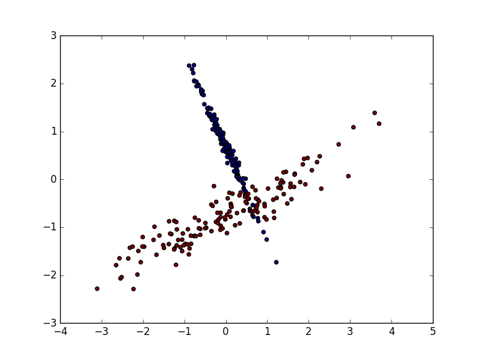

title: scikit-learn（五） sklearn Normalization
summary: sklearn 数据的标准化
tags: Machine-Learning

# Sklearn Normalization
***
由于资料（样本）的**偏差**与**跨度**会影响机器学习的效果， 因此使用`Nomalized`的数据可以减少这种影响。

### 1. 数据标准化
```python
from sklearn import preprocessing
import numpy as np

a = np.array([[10, 2.7, 3.6],
              [-100, 5, -2],
              [120, 20, 40]], dtype=np.float64)

print preprocessing.scale(a)
```
***
> [[ 0.         -0.85170713 -0.55138018]  
 [-1.22474487 -0.55187146 -0.852133  ]  
 [ 1.22474487  1.40357859  1.40351318]]
***

### 2. 数据标准化对机器学习的影响
#### 加载模块
```python
# 数据预处理模块
from sklearn import preprocessing
import numpy as np
# 用来将样本分割成train和test
from sklearn.cross_validation import train_test_split
# 生成用来识别的样本
from sklearn.datasets.samples_generator import make_classification
# Support Vertor Machine 中的 Support Vertor Classifier 
from sklearn.svm import SVC
# 数据可视化模块
import matplotlib.pyplot as plt
```

#### 生成用来Classification的数据

```python
X, y = make_classification(
    n_samples=300, n_features=2,
    n_redundant=0, n_informative=2,
    random_state=22, n_clusters_per_class=1,
    scale=100
)

plt.scatter(X[:, 0], X[:,1], c=y)
plt.show()
```
***

***

#### 数据标准化前的预测率
```python
X_train, X_test, y_train, y_test = train_test_split(X, y, test_size = 0.3)
clf = SVC()
clf.fit(X_train, y_train)
print clf.score(X_test, y_test)
```
***
> 0.644444444444
***

#### 数据标准化后的预测率
从图中可看出经过数据标准化后趋势没有发生变化

***
数据经过标准化以后预测准确率提升至`0.95`以上
```python
X=preprocessing.scale(X)

X_train, X_test, y_train, y_test = train_test_split(X, y, test_size = 0.3)
clf = SVC()
clf.fit(X_train, y_train)
print clf.score(X_test, y_test)
```
***
> 0.955555555556

[查看全部代码](https://github.com/lxy-kyb/scikit-learn-tutorial/blob/master/nomalization_try.py)