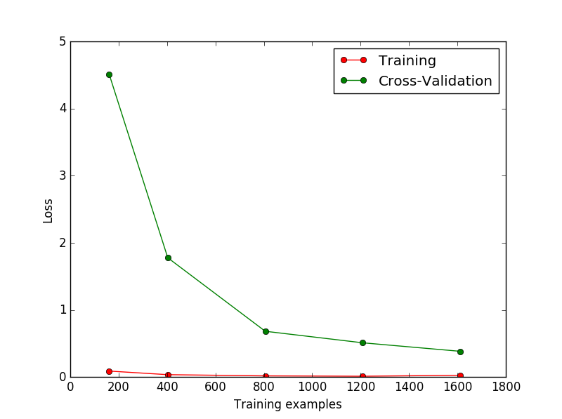
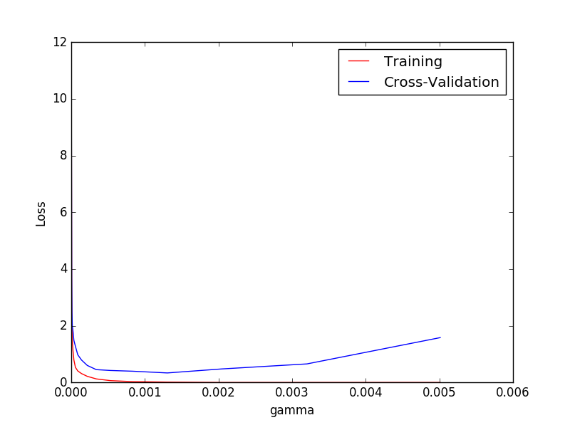

title: scikit-learn（七） 交叉验证 Cross-validation（2）
summary: sklearn 交叉验证
tags: Machine-Learning

# 交叉验证 Cross-validation（2）
***
通过`sklearn.learning_curve`中的`learning curve`可以很直观的看出我们的model学习的进度，
从而对比返现有没有overfitting的问你。然后我可以对model进行调整来克服过拟合问题。

### 1.学习曲线 learning curve
加载需要的模块
```python
from sklearn.learning_curve import learning_curve
from sklearn.datasets import load_digits
from sklearn.svm import SVC
import matplotlib.pyplot as plt
import numpy as np
```
加载digits数据集，其包含的是手写体从0到9的数字。数据集总样本数为1797，
每个样本由64个特征组成，由对应的8*8像素表示，每个特征的取值为0~16。
```python
digits = load_digits()
X = digits.data
y = digits.target
```
观察样本由小到大的学习曲线变化，采用K折交叉验证`cv=10`,选择平均方差检视模型效果`scoring='mean_squared_error'`,
样本由小到大分为5轮检视学习曲线`（10%，25%，50%，75%，100%）`
```python
digits = load_digits()
X = digits.data
y = digits.target

train_size, train_loss, test_lost = learning_curve(
    SVC(gamma=0.001), X, y, cv=10, scoring='mean_squared_error',
    train_sizes=[0.1,0.25,0.5,0.75,1]
)

train_loss_mean = -np.mean(train_loss, axis=1)
test_loss_mean = -np.mean(test_lost, axis=1)
```
数据可视化
```python
plt.plot(train_size, train_loss_mean, 'o-', color='r', label='Training')
plt.plot(train_size,test_loss_mean, 'o-', color='g', label='Cross-Validation')

plt.xlabel('Training examples')
plt.ylabel('Loss')
plt.legend(loc='best')
plt.show()
```


### 2. 验证曲线 validation curve
这次我们来验证SVC中的一个参数gamma在什么范围可以使model产生好的效果，
以及过拟合和gamma取值的关系。

```
rom sklearn.learning_curve import learning_curve
from sklearn.learning_curve import validation_curve
from sklearn.datasets import load_digits
from sklearn.svm import SVC
import matplotlib.pyplot as plt
import numpy as np

digits = load_digits()
X = digits.data
y = digits.target

# plt.show()

#取1.00000000e-06 ~ 5.01187234e-03 之间10个数字
param_range = np.logspace(-6, -2.3, 10)

train_loss, test_loss = validation_curve(
    SVC(), X, y, param_name='gamma', param_range=param_range, cv=10, scoring='mean_squared_error'
)

train_loss_mean = -np.mean(train_loss, axis=1)
test_lost_mean = -np.mean(test_loss, axis=1)

plt.plot(param_range, train_loss_mean, 'o-', color='r', label='Training')
plt.plot(param_range, test_lost_mean, 'o-', color='b', label='Cross-Validation')

plt.xlabel('gamma')
plt.ylabel('Loss')
plt.legend(loc='best')
plt.show()
```
***

***
从图中可以看出当gamma值超过0.001之后交叉验证之后Loss开始增长，由此可见model进入了过拟合状态。

[查看全部代码](https://github.com/lxy-kyb/scikit-learn-tutorial/blob/master/cross_validation_2.py)